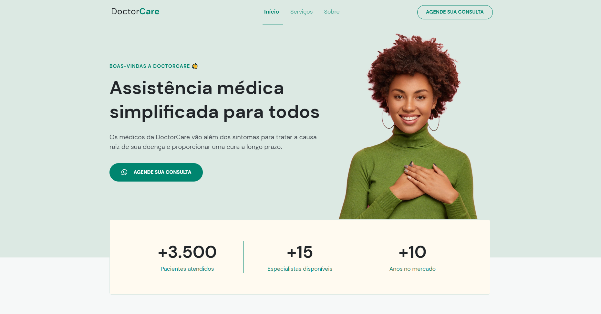

# DoctorCare - NLW 8 🚀

 
> 🚀 <a href="https://lucyanovidio.github.io/doctorcare">Acesse aqui</a> &nbsp; | &nbsp; 
🖌 <a href="https://www.figma.com/community/file/1102912263666619803/DoctorCare">Figma do projeto</a>

## 💻 Sobre

O projeto DoctorCare é um site que foi desenvolvido na Next Level Week 8 ("Return"), trilha Origin, evento da <a href="https://rocketseat.com.br">Rocketseat</a>.
  
***A proposta no evento é aprendermos e praticarmos, então, entre outras coisas, vimos:***
+ Conceitos básicos: HTML semântico, Box-model, variáveis CSS, organização e boas práticas;
+ Iniciando com acessibilidade;
+ Responsividade;
+ Mobile first;
+ Variáveis, funções e operadores em JS;
+ DOM;
+ Utilizando libs JS de terceiros.

## 🧠 Tecnologias usadas

    
    
    

 

---

<table>
  <tr>
    <td>
      
    </td>
    <td>
      
    </td>
    <td>
      Feito por <a href="https://github.com/lucyanovidio">Lucyan Ovídio</a> 🙋🏿‍♂️
        Junto com <a href="https://rocketseat.com.br">Rocketseat</a> 🚀.
    </td>
  </tr>
</table>
